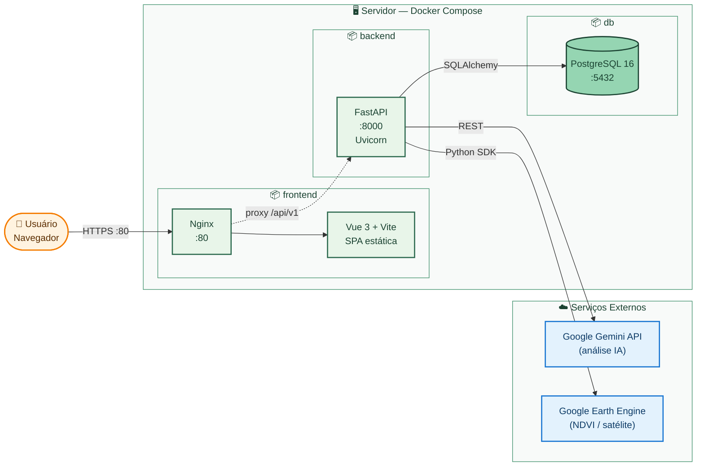
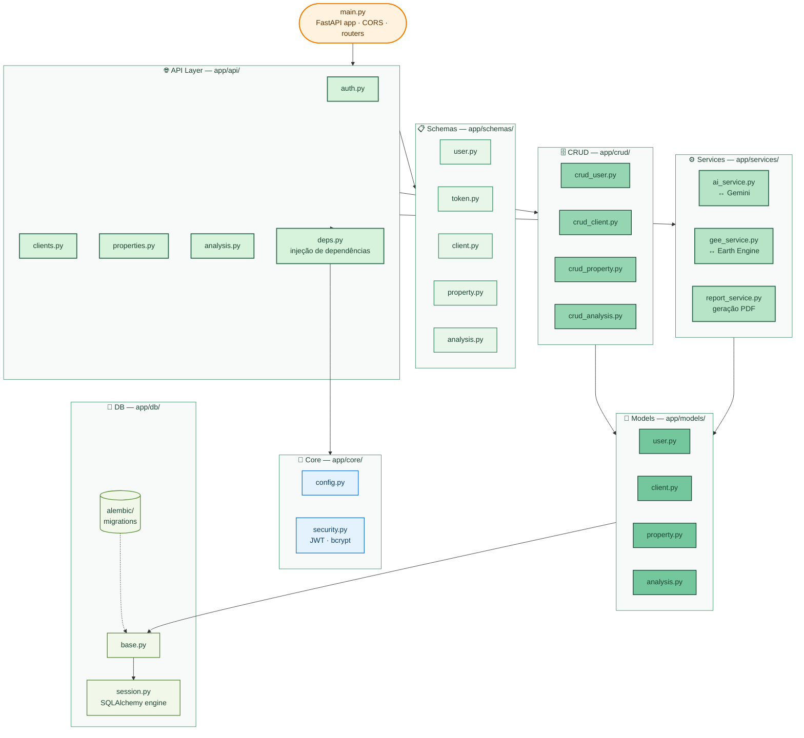
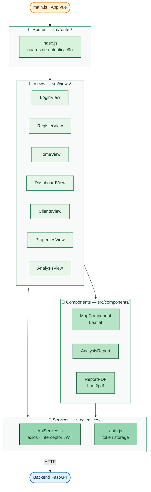
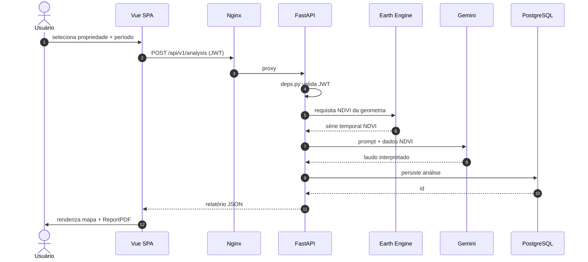

# Arquitetura — CultiveAI

Diagramas em Mermaid prontos para artigo. Renderizam direto no GitHub.
Para exportar PNG/SVG: cole o bloco em [mermaid.live](https://mermaid.live) → *Actions* → *PNG* ou *SVG*.

> Paleta: cores oficiais do CultiveAI (`#2D6A4F`, `#40916C`, `#95D5B2`, `#E8F5E9`).

---

## 1. Visão de Arquitetura — Containers e Integrações

Como a aplicação é orquestrada em produção via **Docker Compose**, com Nginx como reverse proxy e duas integrações externas (Gemini e Google Earth Engine).

---

## 2. Estrutura de Pacotes — Backend (FastAPI)

Arquitetura em camadas. Cada camada só conhece a de baixo, nunca a de cima.

---

## 3. Estrutura de Pacotes — Frontend (Vue 3)

---

## 4. Fluxo de uma Análise NDVI (request lifecycle)

